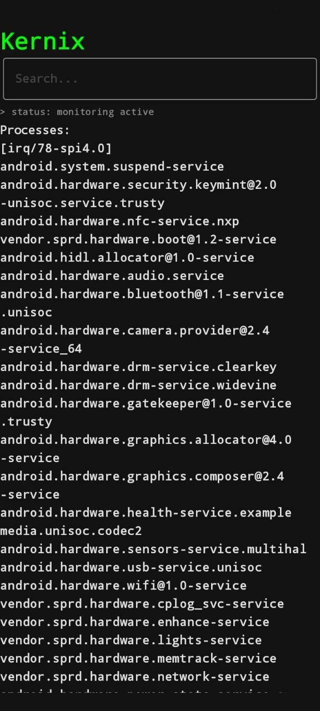

# Kernix

A lightweight process manager and system utility for Android, powered by the Shizuku API.

---

## 🚀 Features

* **Real-time Process List:** View all running processes on your Android device.
* **Detailed Info:** Get accurate PID (Process ID) and User data for each running task.
* **Interactive UI:** Tap on any process to open a detailed dialog with its system parameters.
* **Rootless Power:** Utilizes Shizuku to fetch system-level information safely without requiring full root access.

---

## 🛠️ Tech Stack

* **Language:** Kotlin
* **UI Framework:** Jetpack Compose (Modern, declarative UI)
* **Core API:** Shizuku API (For high-privilege system interactions)

---

## 📸 Screenshots

  

---

## 📋 Requirements & Setup

1. **Shizuku Installed:** You must have the [Shizuku](https://shizuku.rikka.app/) app installed and running on your device.
2. **Wireless Debugging / ADB:** Ensure Shizuku is activated via ADB or Wireless Debugging.
3. **Grant Permissions:** Open Kernix and allow it to access the Shizuku service when prompted.
